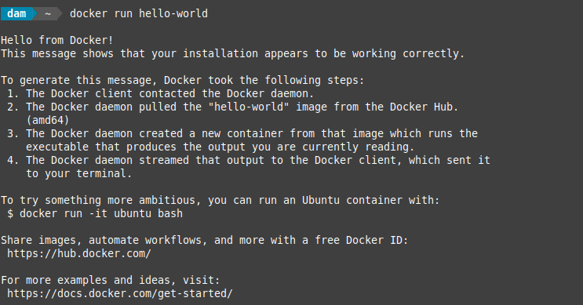
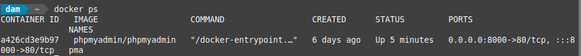
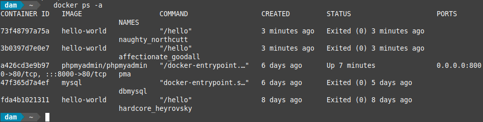
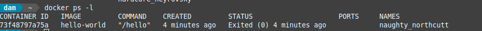
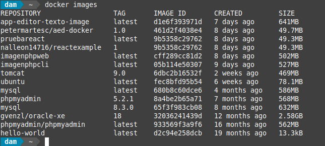

<div align="justify">

## Tarea 1

- [Práctica 01](#práctica-01)
- [Práctica 02](#práctica-02)
- [Práctica 03](#práctica-03)
- [Práctica 04](#práctica-04)
- [Práctica 05](#práctica-05)
- [Práctica 06](#práctica-06)
***

### Práctica 01

> 📂
> Para verificar si puede acceder a imágenes y descargarlas de Docker Hub, escriba lo siguiente: docker run hello-world
>

- Comando:
```bash
docker run hello-world
```

- Captura:
<div align="center">

</div>

</br>

***

### Práctica 02

> 📂
> Después de usar Docker durante un tiempo, tendrá muchos contenedores activos (en ejecución) e inactivos en su computadora. Para ver los activos, utilice lo siguiente:
>

- Comando:
```bash
docker ps
```

- Captura:
<div align="center">

</div>

</br>

***

### Práctica 03

> 📂
> Para ver todos los contenedores, activos e inactivos, ejecute docker ps con el conmutador -a:   docker ps -a
>

- Comando:
```bash
docker ps -a
```

- Captura:
<div align="center">

</div>

***

### Práctica 04

> 📂
> Para ver el último contenedor que creó, páselo al conmutador -l: docker ps -l
>

- Comando:
```bash
docker ps -l
```

- Captura:
<div align="center">
    
</div>

</br>

***

### Práctica 05

> 📂
> Listar las imágenes de Docker de nuevo mostrará la nueva imagen, así como la anterior de la que se derivó: docker images
>

- Comando:
```bash
docker images
```

- Captura:
<div align="center">
    
</div>

</br>

***

### Práctica 06

> 📂
> Listar las imágenes de Docker de nuevo mostrará la nueva imagen, así como la anterior de la que se derivó: docker images
>

- Comando:
```bash
docker images
```

- Captura:
<div align="center">
    
</div>

</br>

***