<div align="justify">

## React - Dossier

- [Práctica 01](#práctica-01)
- [Práctica 02](#práctica-02)
- [Práctica 03](#práctica-03)
- [Práctica 04](#práctica-04)
- [Práctica 05](#práctica-05)
- [Práctica 06](#práctica-06)
- [Práctica 07](#práctica-07)
- [Práctica 08](#práctica-08)
- [Práctica 09](#práctica-09)
- [Práctica 10](#práctica-10)
- [Práctica 11](#práctica-11)
- [Práctica 12](#práctica-12)
- [Extra](#extra)
***

### Práctica 01

> 📂
> Verifica que Docker está instalado y funcionando:
>

```bash
docker -v
```

- Captura:
<div align="center">
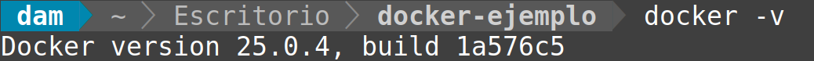
</div>

<br>

***


### Práctica 02

> 📂
> Descarga la imagen oficial de Apache Tomcat desde Docker Hub: docker pull tomcat
>

```bash
docker pull tomcat
```

- Captura:
<div align="center">
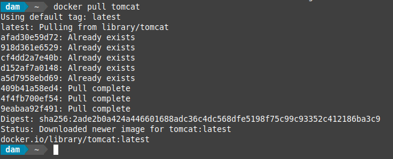
</div>

***
</br>


### Práctica 03

> 📂
> Confirma que la imagen fue descargada correctamente: docker images
>

- Comando:
```bash
docker images
```

- Captura:
<div align="center">

</div>

***
</br>


### Práctica 04

> 📂
> Inicia un contenedor basado en la imagen de Tomcat, asignando un puerto específico (por ejemplo, 9090 en la máquina anfitriona):
>

- Comando:
```bash
docker run -d -p 9090:8080 --name tomcat-server tomcat
```

- Captura:
<div align="center">
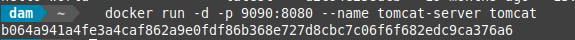
</div>

***
</br>


### Práctica 05

> 📂
> Verifica que el contenedor está en ejecución:
>

- Comando:
```bash
docker ps
```

- Captura:
<div align="center">
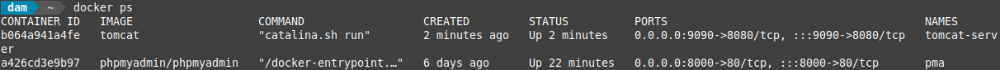
</div>

***
</br>


### Práctica 06

> 📂
> Probar la Configuración. Abre un navegador web y accede a la dirección: http://localhost:9090
>

- Captura:
<div align="center">
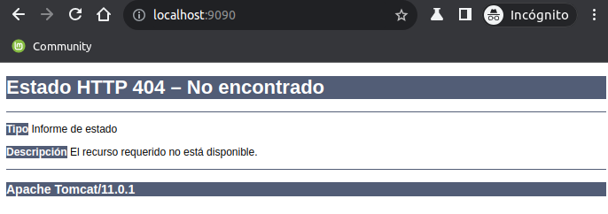
</div>

***
</br>


### Práctica 07

> 📂
> Tanto si accedes por el navegador como si no, accede a los logsdel servidor para ver si el arranque ha sido correcto
>

- Comando:
```bash
docker logs tomcat-server
```

- Captura:
<div align="center">
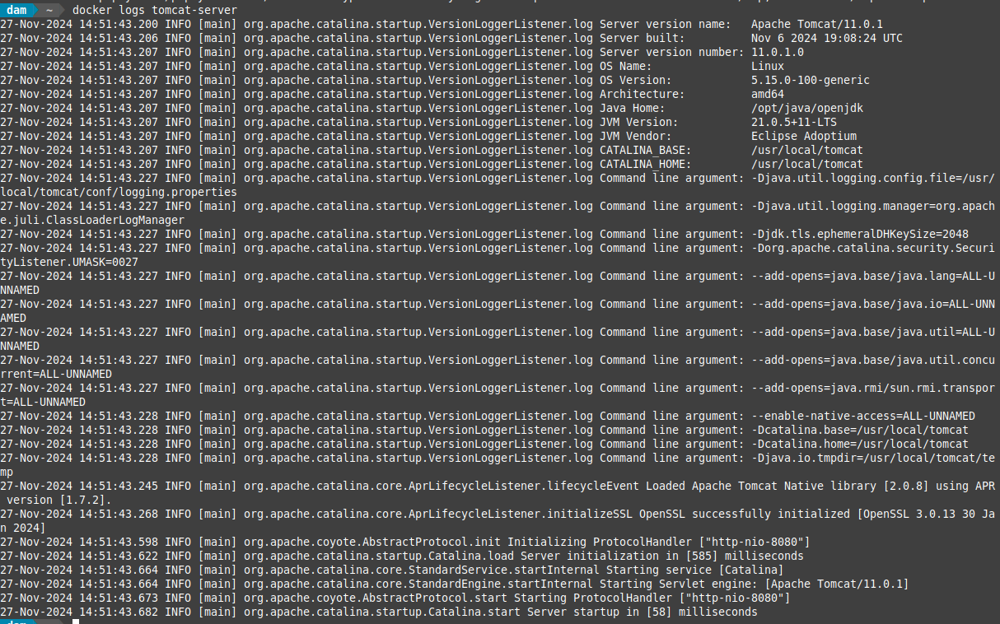
</div>

***
</br>


### Práctica 08

> 📂
> Verifica además que no hubieran conflicto de puertos:
>

- Comando:
```bash
lsof -i :9090
```

- Captura:
<div align="center">
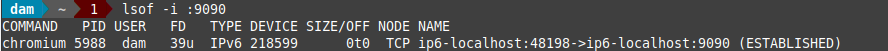
</div>

***
</br>


### Práctica 09

> 📂
> Detén el contenedor:
>

- Comando:
```bash
docker stop tomcat-server
```

- Captura:
<div align="center">
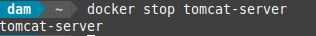
</div>

***
</br>


### Práctica 10

> 📂
> Si deseas eliminar la imagen de Tomcat de tu sistema:
>

- Comando:
```bash
docker rm tomcat-server
```

- Captura:
<div align="center">
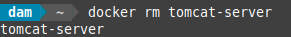
</div>

***
</br>


### Práctica 11

> 📂
> Si deseas eliminar la imagen de Tomcat de tu sistema:
>

- Comando:
```bash
docker rmi tomcat
```

- Captura:
<div align="center">
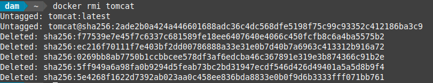
</div>

***
</br>

### Extra

> 📂
> Arranca apache tomcat en otro puerto, y verifica realiza los pasos anteriores.
> *** 
> 📂 Configura un volumen Docker para persistir los datos de configuración de Tomcat en tu máquina anfitriona. Explora cómo montar directorios locales con el parámetro -v.
>

- Comandos:
```bash
docker pull tomcat
docker run -d -p 9091:8080 --name tomcat-server tomcat
docker ps
docker logs tomcat-server
lsof -i :9091
```

- Captura:
<div align="center">
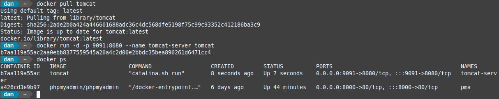
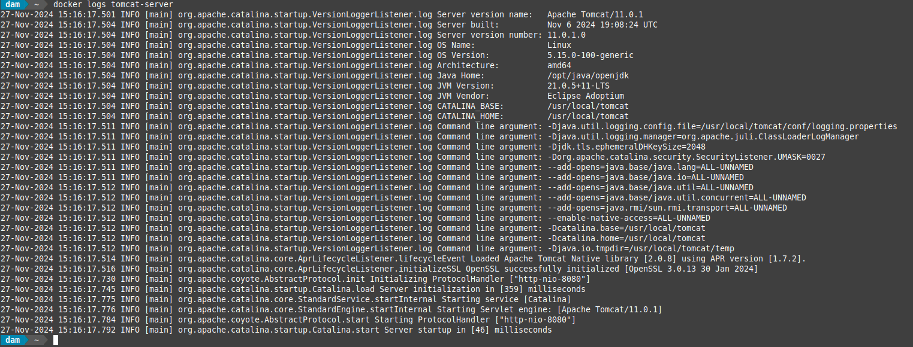
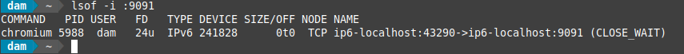

</div>

***

- Comandos:
```bash
docker run -d -p 9091:8080 --name tomcat-server -v tomcat-volume:/app tomcat
docker volume ls
```

- Captura:
<div align="center">
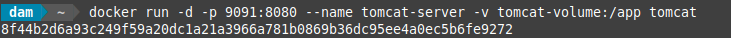
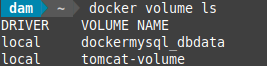
</div>

***

</br>