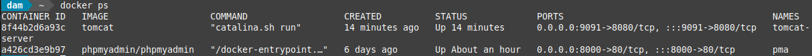
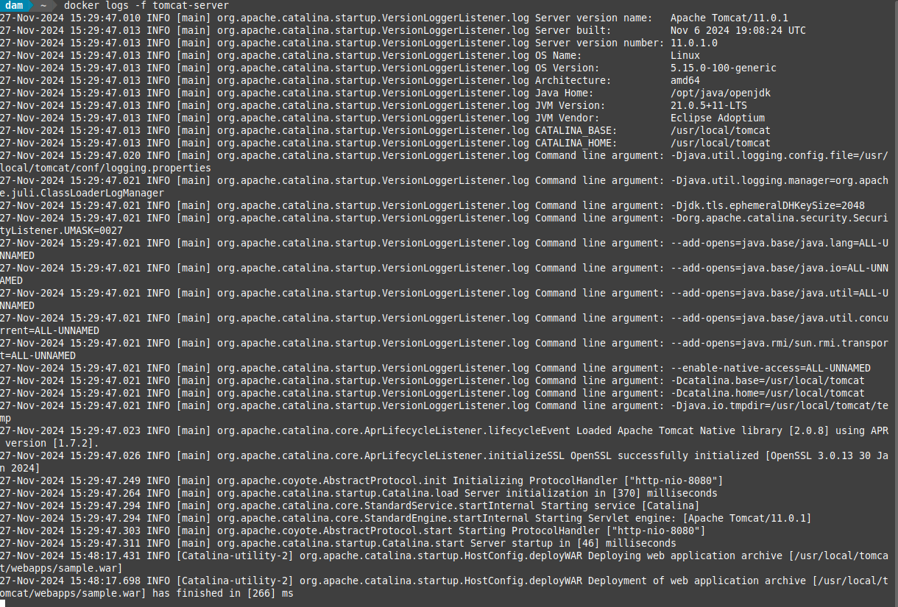

<div align="justify">

## Tarea 3

- [Práctica 01](#práctica-01)
    - [Práctica 01.1](#práctica-011)
    - [Práctica 01.2](#práctica-012)
    - [Práctica 01.3](#práctica-013)
    - [Práctica 01.4](#práctica-014)
    - [Práctica 01.5](#práctica-015)

***

### Práctica 01

#### Práctica 01.1

> 📂
> Desplegar una aplicación en Apache Tomcat.
>

- Captura:
<div align="center">

</div>

<br>

***

#### Práctica 01.2

> 📂
> Descargar un archivo .war de ejemplo
>

En este caso haremos uso del [Sample Web Application](https://tomcat.apache.org/tomcat-11.0-doc/appdev/sample/) para estas prácticas.

```bash
docker cp /home/dam/Descargas/sample.war tomcat-server:/usr/local/tomcat/webapps
```

- Captura:
<div align="center">

</div>

***
</br>

#### Práctica 01.3

> 📂
> Acceder a la aplicación
Una vez copiado el archivo .war y desplegado en Tomcat, puedes acceder a la aplicación de ejemplo a través de la URL:
>

```bash
http://localhost:9091/sample
```

- Captura:
<div align="center">

</div>

***
</br>

#### Práctica 01.4

> 📂
> Verificar logs en caso de problemas
Si la aplicación de ejemplo tampoco funciona, revisa los logs de Tomcat para detectar posibles errores:
>

En este caso no ha habido ningún tipo de incidencia al lanzar la aplicación.

- Comando:
```bash
docker logs -f tomcat-server
```

- Captura:
<div align="center">

</div>

***
</br>

#### Práctica 01.5

> 📂
> Utiliza docker inspect
Puedas o no acceder, intenta usar la IP del contenedor Docker (que puedes obtener con docker inspect).
>

- Comando:
```bash
docker inspect tomcat-server
```

- Salida:
```bash
[
    {
        "Id": "8f44b2d6a93c249f59a20dc1a21a3966a781b0869b36dc95ee4a0ec5b6fe9272",
        "Created": "2024-11-27T15:29:46.309721959Z",
        "Path": "catalina.sh",
        "Args": [
            "run"
        ],
        "State": {
            "Status": "running",
            "Running": true,
            "Paused": false,
            "Restarting": false,
            "OOMKilled": false,
            "Dead": false,
            "Pid": 33908,
            "ExitCode": 0,
            "Error": "",
            "StartedAt": "2024-11-27T15:29:46.746385499Z",
            "FinishedAt": "0001-01-01T00:00:00Z"
        },
        "Image": "sha256:f77539e7e45f7c6337c681589fe18ee6407640e4066c450fcfb8c6a4ba5575b2",
        "ResolvConfPath": "/var/lib/docker/containers/8f44b2d6a93c249f59a20dc1a21a3966a781b0869b36dc95ee4a0ec5b6fe9272/resolv.conf",
        "HostnamePath": "/var/lib/docker/containers/8f44b2d6a93c249f59a20dc1a21a3966a781b0869b36dc95ee4a0ec5b6fe9272/hostname",
        "HostsPath": "/var/lib/docker/containers/8f44b2d6a93c249f59a20dc1a21a3966a781b0869b36dc95ee4a0ec5b6fe9272/hosts",
        "LogPath": "/var/lib/docker/containers/8f44b2d6a93c249f59a20dc1a21a3966a781b0869b36dc95ee4a0ec5b6fe9272/8f44b2d6a93c249f59a20dc1a21a3966a781b0869b36dc95ee4a0ec5b6fe9272-json.log",
        "Name": "/tomcat-server",
        "RestartCount": 0,
        "Driver": "overlay2",
        "Platform": "linux",
        "MountLabel": "",
        "ProcessLabel": "",
        "AppArmorProfile": "docker-default",
        "ExecIDs": null,

        ...
    }
]
 ```

</br>