<div align="justify">

## Tarea 5

- [Práctica 01](#práctica-01)
    - [Práctica 01.1](#práctica-011)
    - [Práctica 01.2](#práctica-012)
    - [Práctica 01.3](#práctica-013)
    - [Práctica 01.4](#práctica-014)
    - [Práctica 01.5](#práctica-015)
    - [Práctica 01.6](#práctica-016)
    - [Práctica 01.7](#práctica-017)
***

### Práctica 01

#### Práctica 01.1

> 📂
> Lista el conjunto de redes disponibles en este momento.
>

- Comando:
```bash
docker network ls
```

- Captura:
<div align="center">
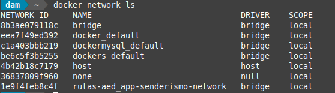
</div>

<br>

***

#### Práctica 01.2

> 📂
> Docker necesita una red personalizada para que los contenedores puedan comunicarse entre sí. Ejecuta el siguiente comando:
>


```bash
docker network create tomcat-network
```

- Captura:
<div align="center">
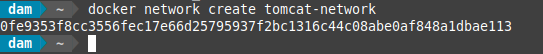
</div>

</br>

***


#### Práctica 01.3

> 📂
> Levanta dos contenedores Tomcat y conéctalos a la red tomcat-network.
>


```bash
docker run -d --name tomcat1 --network tomcat-network -p 8081:8080 tomcat:latest
docker run -d --name tomcat2 --network tomcat-network -p 8082:8080 tomcat:latest
```

- Captura:
<div align="center">
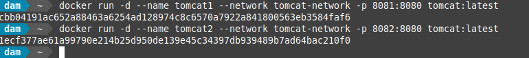
</div>


</br>

***

#### Práctica 01.4

> 📂
> Muestra los contenedores dockers activos en ese momento
>

- Comandos:
```bash
docker ps
```


- Captura:
<div align="center">
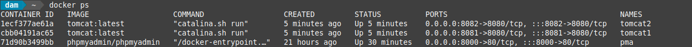

</div>

</br>

***


#### Práctica 01.5

> 📂
> Crea el fichero de balance nginx.conf en el mismo direcctorio donde estes ejecutando la consola de comandos.
>

- Contenido de nginx:
```bash
events {}

http {
    upstream tomcat_backend {
        server tomcat1:8080;
        server tomcat2:8080;
    }

    server {
        listen 80;

        location / {
            proxy_pass http://tomcat_backend;
            proxy_set_header Host $host;
            proxy_set_header X-Real-IP $remote_addr;
            proxy_set_header X-Forwarded-For $proxy_add_x_forwarded_for;
        }
    }
}
```

- Comando:
```bash
docker run -d --name nginx --network tomcat-network -p 8090:80 -v /home/dam/nginx.conf:/etc/nginx/nginx.conf nginx:latest
```

- Captura:
<div align="center">
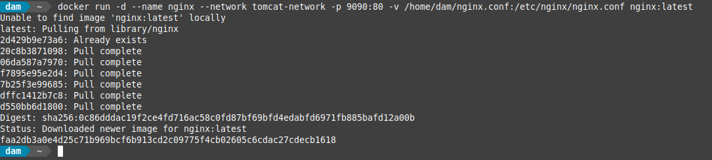
</div>

</br>

***

#### Práctica 01.6

> 📂
> Verificar que todo esta funcionando correctamente Servidor NGINX
Verifica el comportamiento en:
>

- Comprobar:
```bash
http://localhost:8081
http://localhost:8082
http://localhost:9090
```

- Captura:
<div align="center">
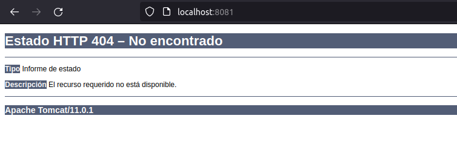
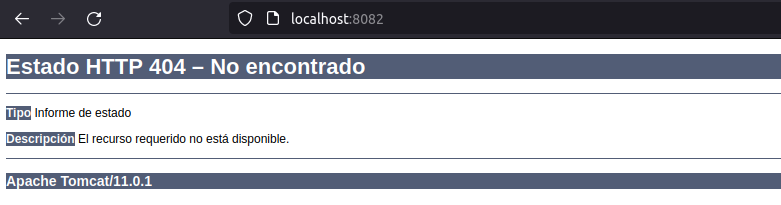
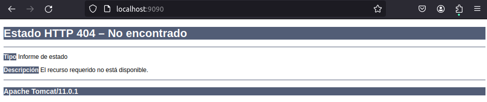
</div>


<br>
***

#### Práctica 01.7

> 📂
> Realiza el despliegue de la aplicación sample repitiendo los pasos del apartado anterior comprobando los puertos 8081,8082 y 9090 de localhost.


- Captura:
<div align="center">
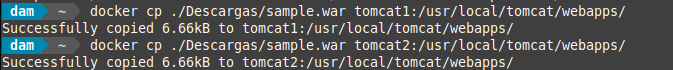
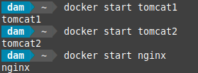
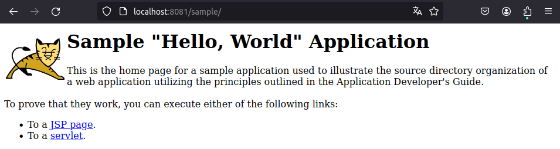
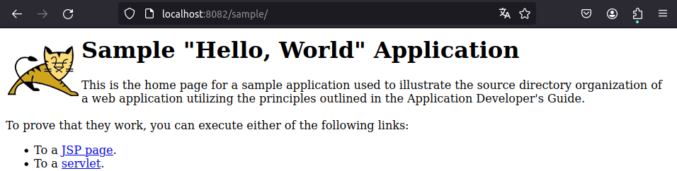
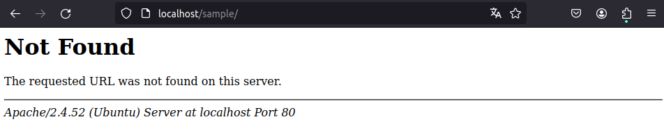
</div>


<br>
***