<div align="justify">

## Tarea 5

- [Práctica 01](#práctica-01)
    - [Práctica 01.1](#práctica-011)
    - [Práctica 01.2](#práctica-012)
    - [Práctica 01.3](#práctica-013)
    - [Práctica 01.4](#práctica-014)
    - [Práctica 01.5](#práctica-015)
    - [Práctica 01.6](#práctica-016)
    - [Práctica 01.7](#práctica-017)
    - [Práctica 01.8](#práctica-018)
    - [Práctica 01.9](#práctica-019)
    - [Práctica 01.11](#práctica-0111)
    - [Práctica 01.12](#práctica-0112)
    - [Práctica 01.13](#práctica-0113)
    - [Práctica 01.14](#práctica-0114)
    - [Práctica 01.15](#práctica-0115)
    - [Práctica 01.16](#práctica-0116)
***

### Práctica 01

#### Práctica 01.1

> 📂
> Lista el conjunto de redes disponibles en este momento.
>

- Comando:
```bash
docker network ls
```

- Captura:
<div align="center">
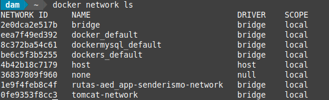
</div>

<br>

***

#### Práctica 01.2

> 📂
> Crear una Red Personalizada. Ejecuta el siguiente comando para crear una red llamada mongodb-network y vuelve a listar las redes disponibles
>


```bash
docker network create mongodb-network
```

- Captura:
<div align="center">
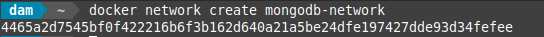
</div>

```bash
docker network ls
```

- Captura:
<div align="center">
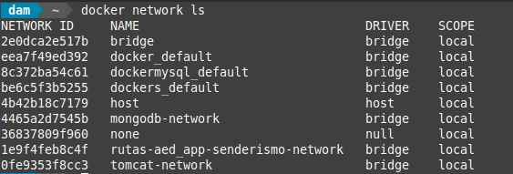
</div>

</br>

***


#### Práctica 01.3

> 📂
> Crear un Volumen para MongoDB
Ejecuta el siguiente comando para crear un volumen llamado mongodb-data:
>


```bash
docker volume create mongodb-data
```

- Captura:
<div align="center">
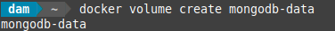
</div>

Ejecuta docker volume ls, y muestra el resultado:

```bash
docker volume ls
```

- Captura:
<div align="center">
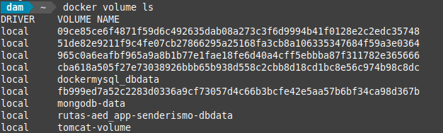
</div>


</br>

***

#### Práctica 01.4

> 📂
> Levantar el Contenedor MongoDB. Usa el siguiente comando para ejecutar MongoDB con el volumen y la red configurados:
>

- Comandos:
```bash
docker run -d --name mongodb-container \
  --network mongodb-network \
  -e MONGO_INITDB_ROOT_USERNAME=admin \
  -e MONGO_INITDB_ROOT_PASSWORD=admin123 \
  -v mongodb-data:/data/db \
  -p 27017:27017 \
  mongo:latest
```


- Captura:
<div align="center">
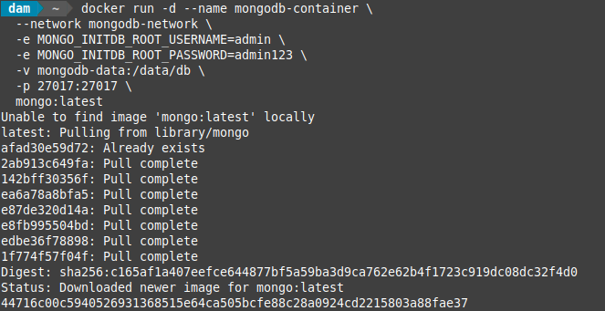

</div>

</br>

***


#### Práctica 01.5

> 📂
> Levantar el Contenedor Mongo Express. Mongo Express es un cliente web para gestionar MongoDB. Usa este comando para levantar el contenedor:
>

- Comando:
```bash
docker run -d --name mongo-express-container \
  --network mongodb-network \
  -e ME_CONFIG_MONGODB_ADMINUSERNAME=admin \
  -e ME_CONFIG_MONGODB_ADMINPASSWORD=admin123 \
  -e ME_CONFIG_MONGODB_SERVER=mongodb-container \
  -p 8081:8081 \
  mongo-express:latest
```

- Captura:
<div align="center">
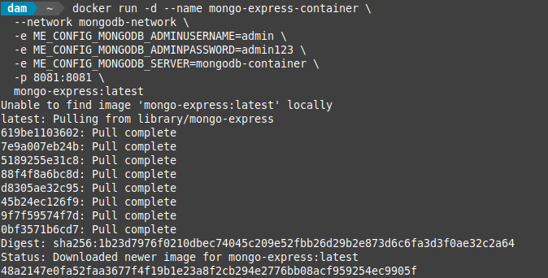
</div>

</br>

***

#### Práctica 01.6

> 📂
> Verificar los Contenedores Activos
Lista los contenedores activos para asegurarte de que están funcionando correctamente:
>

- Comando:
```bash
docker ps
```

- Captura:
<div align="center">
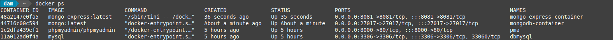
</div>


<br>

***

#### Práctica 01.7

> 📂
> Verifica logs de Mongo Express:
>


```bash
docker logs mongo-express-container
```

- Captura:
<div align="center">
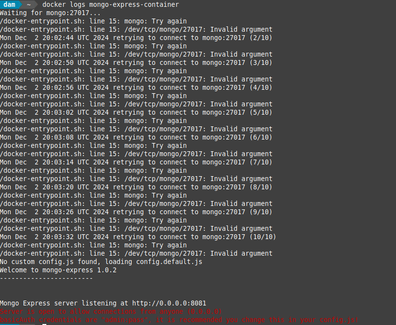
</div>

<br>

***


#### Práctica 01.8

> 📂
> Acceder al Cliente Mongo Express Abre tu navegador y visita:
>


- Direccion a visitar:
```bash
localhost:8081
```

- Captura:
<div align="center">
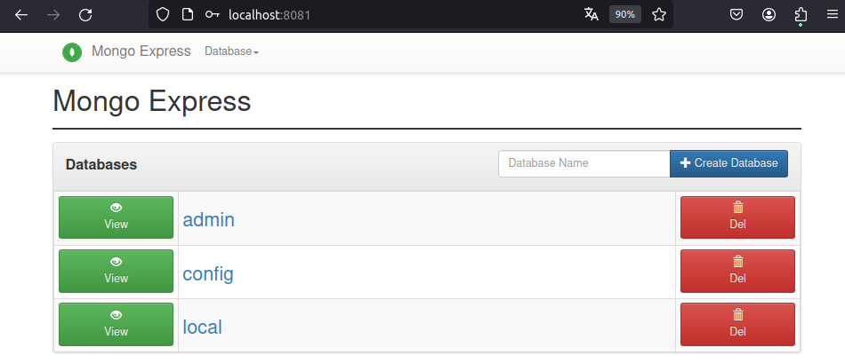
</div>

<br>

***


#### Práctica 01.9

> 📂
> Accede a MongoDB desde el Cliente Crea una nueva base de datos llamada testdb.
>

- Captura:
<div align="center">
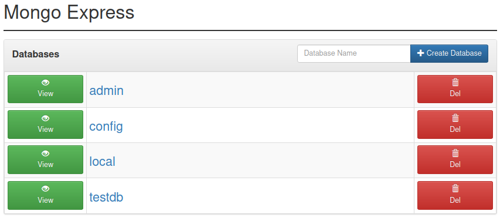
</div>

<br>

***


#### Práctica 01.10

> 📂
> Crear la Colección users.
>

- Captura:
<div align="center">
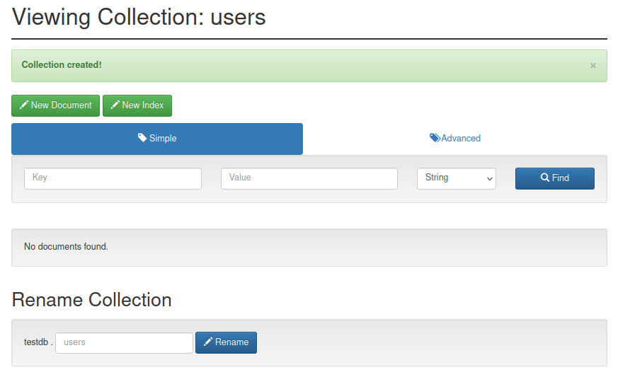
</div>

<br>

***


#### Práctica 01.11

> 📂
> Añadir Documentos a la Colección users.
>

- Captura:
<div align="center">
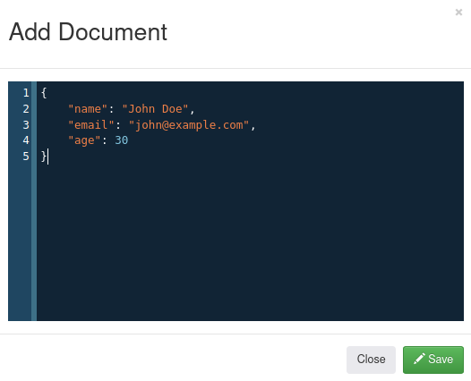
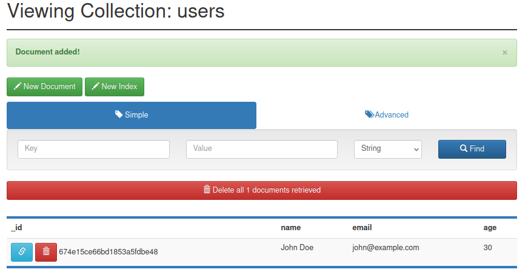
</div>

<br>

***

#### Práctica 01.12

> 📂
> Lanza el diagnóstico de red a través del siguiente comando.
>


- Captura:
<div align="center">
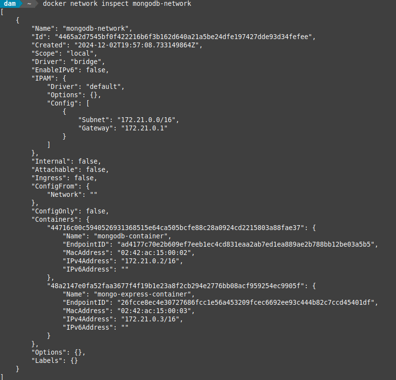
</div>

<br>

***

#### Práctica 01.13

> 📂
> Realiza la verificación con la conectividad de la BBDD. Lanza el siguiente comando:
>

- Comando:
```bash
docker exec -it mongodb-container mongosh -u admin -p admin123
```

- Captura:
<div align="center">
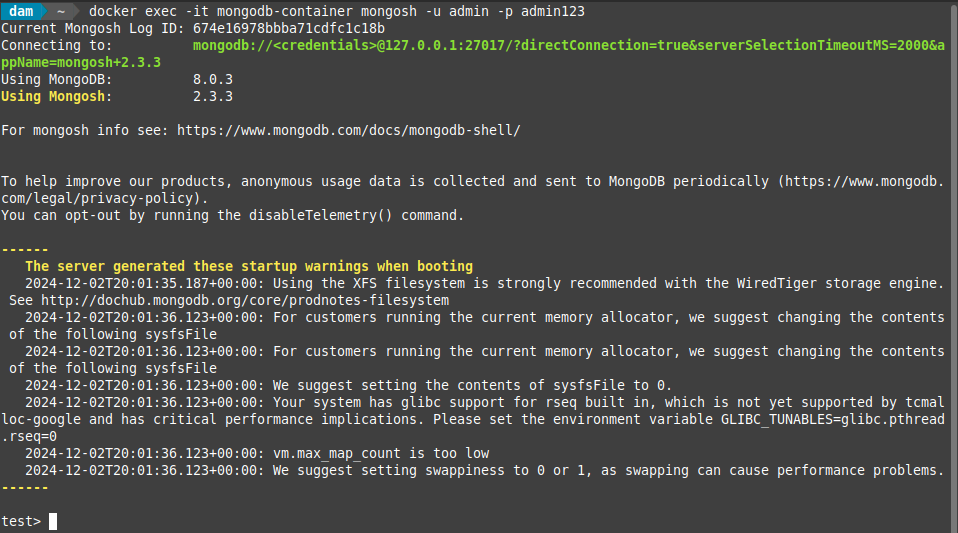
</div>

<br>

***

#### Práctica 01.14

> 📂
> Utiliza la BBDD testdb y lista las coleciones.
>

- Comandos:
```bash
use testdb
show collections
```

- Capturas:
<div align="center">
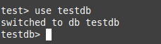
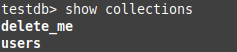
</div>

> 📂
> Añade un nuevo documento a la colección
>

- Comando:
```bash
db.users.insertOne({
    name: "Pepe",
    email: "quiero-ser-como-pepe@example.com",
    age: 65
})
```

- Captura:
<div align="center">

</div>

> 📂
> Muestra los valores almacenados:
>

- Comando:
```bash
db.users.find()
```

- Captura:
<div align="center">
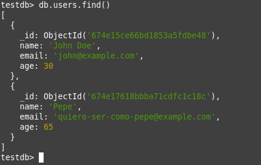
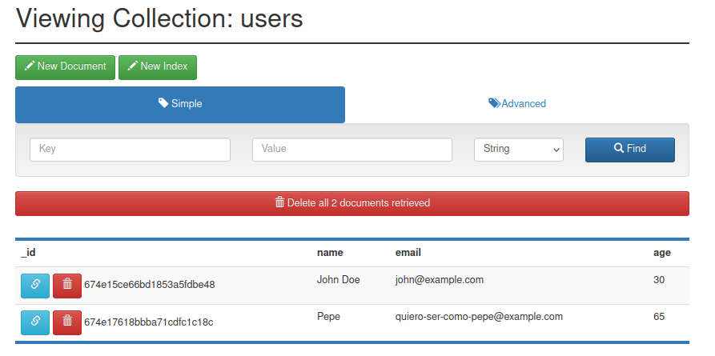
</div>

<br>

***


#### Práctica 01.15

> 📂
> Detener y eliminar contenedores
>

- Comando:
```bash
docker stop mongodb-container
docker stop mongo-express-container
docker rm mongodb-container
docker rm mongo-express-container
```

- Captura:
<div align="center">
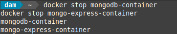
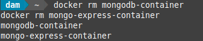
</div>


<br>

***

#### Práctica 01.16

> 📂
> Realiza nuevamente la instalación de los contenedores y verifica el estado de la bbdd testdb.
>

- Captura:
<div align="center">
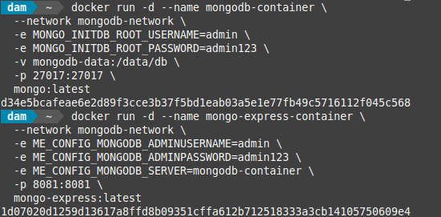
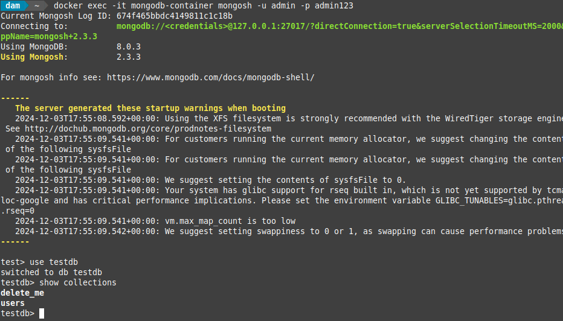
</div>


<br>
***
