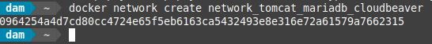
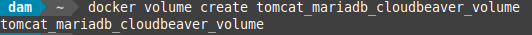
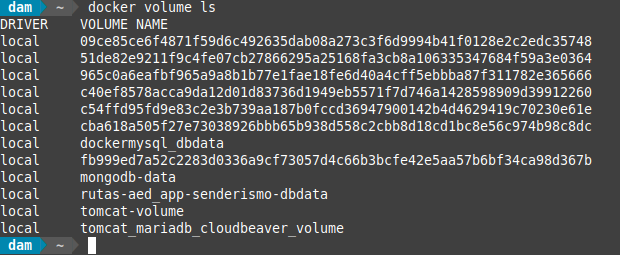

<div align="justify">

## Tarea 7

El objetivo de este ejercicio es crear un entorno con Docker que incluya un servidor Tomcat, una base de datos MariaDB y un cliente para acceder a la base de datos. Para esto, configuraremos los contenedores con redes personalizadas y un volumen común para persistir datos.

- [Práctica 01](#práctica-01)
    - [Práctica 01.1](#práctica-011)
    - [Práctica 01.2](#práctica-012)
    - [Práctica 01.3](#práctica-013)
    - [Práctica 01.4](#práctica-014)
    - [Práctica 01.5](#práctica-015)
    - [Práctica 01.6](#práctica-016)
    - [Práctica 01.7](#práctica-017)
    - [Práctica 01.8](#práctica-018)
    - [Práctica 01.9](#práctica-019)
    - [Práctica 01.11](#práctica-0111)
    - [Práctica 01.12](#práctica-0112)
    - [Práctica 01.13](#práctica-0113)
    - [Práctica 01.14](#práctica-0114)
    - [Práctica 01.15](#práctica-0115)
    - [Práctica 01.16](#práctica-0116)
***

### Práctica 01

#### Práctica 01.1

> 📂
> Crea la red personalizada para que los contenedores puedan comunicarse entre sí.
>

- Comando:
```bash
docker network create network_tomcat_mariadb_cloudbeaver
```

- Captura:
<div align="center">

</div>

<br>

***

#### Práctica 01.2

> 📂
> rea un volumen Docker para persistir los datos.
>


```bash
docker volume create tomcat_mariadb_cloudbeaver_volume
```

- Captura:
<div align="center">

</div>

```bash
docker volume ls
```

- Captura:
<div align="center">

</div>

</br>

***

#### Práctica 01.3

> 📂
> Crea la red personalizada para que los contenedores puedan comunicarse entre sí.
>

- Comando:
```bash
docker network create network_tomcat_mariadb_cloudbeaver
```

- Captura:
<div align="center">

</div>

<br>

***

#### Práctica 01.4

> 📂
> A continuación, creamos un Dockerfile que instalará Tomcat, MariaDB y CloudBeaver.
>

- Dockerfile:
```text
# Usar una imagen base de Ubuntu para las instalaciones adicionales
FROM ubuntu:20.04

# Instalar dependencias necesarias (como wget y curl)
RUN apt-get update -y && \
    apt-get install -y \
    wget \
    curl \
    unzip \
    mysql-client \
    && rm -rf /var/lib/apt/lists/*

# Configurar MariaDB usando la imagen oficial
FROM mariadb:10.5

# Configurar Tomcat usando la imagen oficial
FROM tomcat:9.0

# Descargar y configurar CloudBeaver utilizando la imagen oficial de CloudBeaver desde Docker Hub
FROM dbeaver/cloudbeaver:latest

# Exponer puertos
EXPOSE 8080 8081

# Volúmenes para MariaDB
VOLUME /var/lib/mysql

# Configuración de MariaDB: Establecer la contraseña root y crear la base de datos (esto es suficiente con las variables de entorno)
ENV MYSQL_ROOT_PASSWORD=root
ENV MYSQL_DATABASE=exampledb

# Iniciar los servicios de MariaDB, Tomcat y CloudBeaver
CMD service mysql start && \
    /opt/tomcat/bin/catalina.sh run & \
    /opt/cloudbeaver/cloudbeaver/bin/cloudbeaver & \
    wait
```

<br>

***

</div>