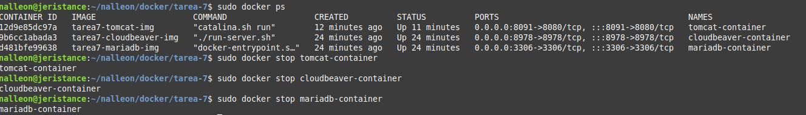

<div align="justify">

## Tarea 7

El objetivo de este ejercicio es crear un entorno con Docker que incluya un servidor Tomcat, una base de datos MariaDB y un cliente para acceder a la base de datos. Para esto, configuraremos los contenedores con redes personalizadas y un volumen común para persistir datos.

- [Práctica 01](#práctica-01)
    - [Práctica 01.1](#práctica-011)
    - [Práctica 01.2](#práctica-012)
    - [Práctica 01.3](#práctica-013)
    - [Práctica 01.4](#práctica-014)
    - [Práctica 01.5](#práctica-015)
    - [Práctica 01.6](#práctica-016)
    - [Práctica 01.7](#práctica-017)
    - [Práctica 01.8](#práctica-018)
- [Extra](#extra)

***

### Práctica 01

#### Práctica 01.1

> 📂
> Crea la red personalizada para que los contenedores puedan comunicarse entre sí.
>

- Comando:
```bash
docker network create network_tomcat_mariadb_cloudbeaver
```

- Captura:
<div align="center">

</div>

<br>

***

#### Práctica 01.2

> 📂
> rea un volumen Docker para persistir los datos.
>


```bash
docker volume create tomcat_mariadb_cloudbeaver_volume
```

- Captura:
<div align="center">

</div>

```bash
docker volume ls
```

- Captura:
<div align="center">

</div>

</br>

***

#### Práctica 01.3

> 📂
> Crea la red personalizada para que los contenedores puedan comunicarse entre sí.
>

- Comando:
```bash
docker network create network_tomcat_mariadb_cloudbeaver
```

- Captura:
<div align="center">

</div>

<br>

***

#### Práctica 01.4

> 📂
> A continuación, creamos un Dockerfile que instalará Tomcat, MariaDB y CloudBeaver.
>

Para evitar los problemas de utilizar multiples imagenes en un mismo dockerfile y que perdamos la información, hemos decidido crear un Dockerfile para cada Tomcat, MariaDB y CloudBeaver respectivamente.

- TomcatDockerfile:

```bash
# Usar la imagen oficial de Tomcat
FROM tomcat:latest

# Copiar la aplicación web al directorio de Tomcat
COPY ./assets/sample.war /usr/local/tomcat/webapps/

# Exponer el puerto de Tomcat
EXPOSE 8080
```

- MariaDBDockerfile:

```bash
# Usar la imagen oficial de MariaDB
FROM mariadb:latest

# Establecer configuración inicial
ENV MYSQL_ROOT_PASSWORD=root
ENV MYSQL_DATABASE=exampledb

# Exponer el puerto de MariaDB
EXPOSE 3306

```

- CloudBeaverDockerfile:

```bash
# Usar la imagen oficial de CloudBeaver
FROM dbeaver/cloudbeaver:latest

# Exponer el puerto de CloudBeaver
EXPOSE 8978
```

<br>

***


#### Práctica 01.5

> 📂
> Construcción de las imagenes.
>

- Comando:
```bash
 docker build -t tarea7-tomcat-img -f TomcatDockerfile .
 docker build -t tarea7-mariadb-img -f MariaDBDockerfile .
 docker build -t tarea7-cloudbeaver-img -f CloudBeaverDockerfile .
```

- Capturas:
<div align="center">


</div>


<br>

***

#### Práctica 01.6

> 📂
> Ejecución del contenedor
>

- Comando:

```bash
 docker run --name tomcat-container -d -p 8091:8080 tarea7-tomcat-img
 docker run --name mariadb-container -d -p 3306:3306 tarea7-mariadb-img
 docker run --name cloudbeaver-container -d -p 8978:8978 tarea7-cloudbeaver-img
```

- Capturas:
<div align="center">


</div>

<br>

***

#### Práctica 01.7

> 📂
> Añadimos manualmente nuestros contenedores a la red
>

- Comando:

```bash
docker network connect network_tomcat_mariadb_cloudbeaver tomcat-container
docker network connect network_tomcat_mariadb_cloudbeaver mariadb-container
docker network connect network_tomcat_mariadb_cloudbeaver cloudbeaver-container
```

<br>

#### Práctica 01.8

> 📂
> Tratamos de acceder a CloudBeaver y testear la conexión con la bbdd así cómo probar que tomcat esta ejecutandose
>

- Direcciones a comprobar:

```bash
localhost:8978
localhost:8091/sample
```


- Capturas:
<div align="center">


</div>

<br>

#### Práctica 01.8

> 📂
> Detener y eliminar los contenedores
>

- Comandos:

```bash
docker stop tomcat-container
docker stop mariadb-container
docker stop cloudbeaver-container
docker rm tomcat-container
docker rm mariadb-container
docker rm cloudbeaver-container
```


- Capturas:
<div align="center">


</div>

<br>

### Extra

> 📂
> Utilizar docker-compose para hacer uso de un único archivo:
>

- Docker Compose:

```bash
version: '3.9'
services:
  mariadb:
    image: mariadb:11.1.2
    container_name: mariadb
    environment:
      MYSQL_ROOT_PASSWORD: root
      MYSQL_DATABASE: exampledb
    volumes:
      - tomcat_mariadb_cloudbeaver_volume:/var/lib/mysql
    ports:
      - "3306:3306"
    networks:
      - network_tomcat_mariadb_cloudbeaver

  tomcat:
    image: tomcat:10.1.9-jdk17
    container_name: tomcat
    ports:
      - "8091:8080"
    volumes:
      - ./assets/sample.war:/usr/local/tomcat/webapps/sample.war
    networks:
      - network_tomcat_mariadb_cloudbeaver

  cloudbeaver:
    image: dbeaver/cloudbeaver:23.3.0
    container_name: cloudbeaver
    ports:
      - "8978:8978"
    networks:
      - network_tomcat_mariadb_cloudbeaver

volumes:
  tomcat_mariadb_cloudbeaver_volume:
networks:
  network_tomcat_mariadb_cloudbeaver:
```

- Capturas:

<div align="center">
    
    
    
</div>


</div>