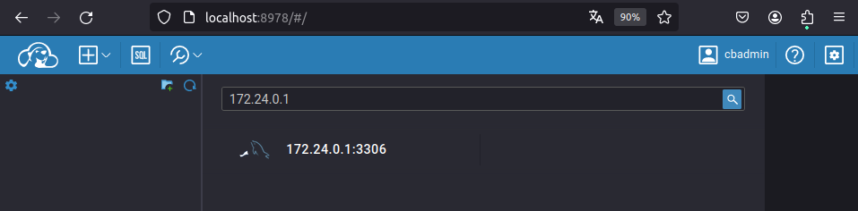
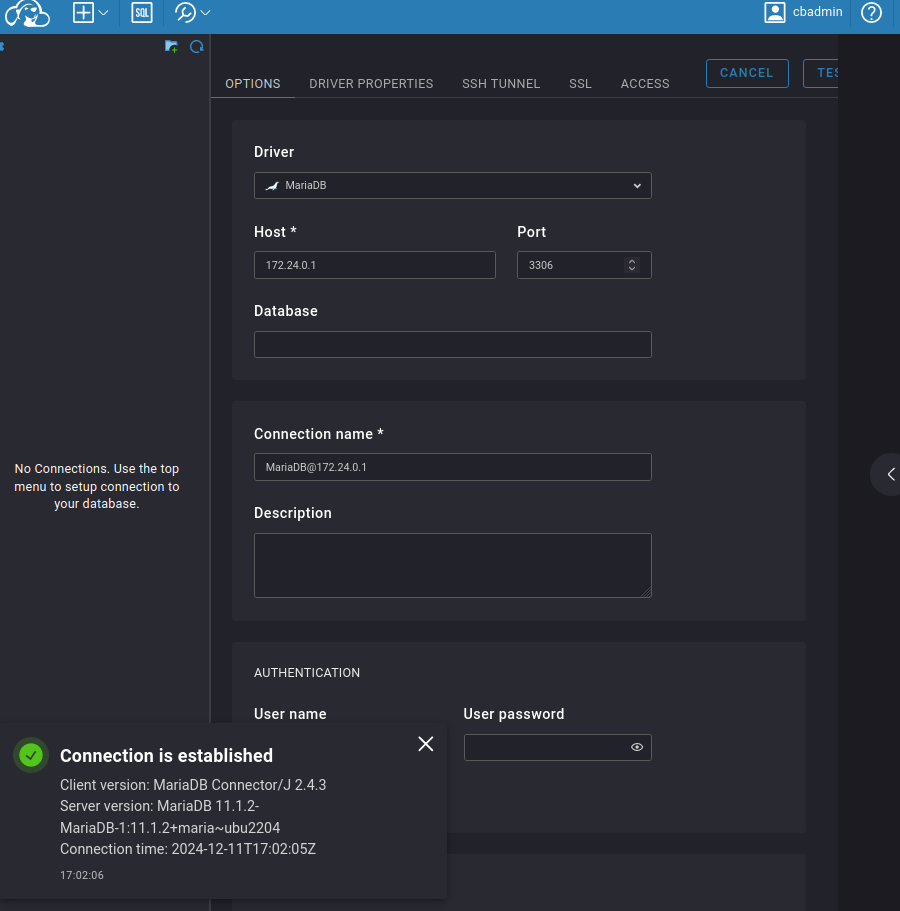

<div align="justify">

## Tarea 8

El objetivo de este ejercicio es crear un entorno con Docker que incluya dos servidores Tomcat, una base de datos MariaDB y una bbdd no sql y así como los clientes para acceder a ambas bases de datos. Para esto, configuraremos los contenedores con redes personalizadas y un volumen común para persistir datos.

- [Práctica 01](#práctica-01)
    - [Práctica 01.1](#práctica-011)
    - [Práctica 01.2](#práctica-012)
    - [Práctica 01.3](#práctica-013)
    - [Práctica 01.4](#práctica-014)

***

### Práctica 01

#### Práctica 01.1

> 📂
> Crea la red personalizada para que los contenedores puedan comunicarse entre sí.
>

- Comando:
```bash
docker network create tarea8_network
```

- Captura:
<div align="center">

</div>

<br>

***

#### Práctica 01.2

> 📂
> Crea un volumen Docker para persistir los datos.
>


```bash
docker volume create tarea8_volume
```

- Captura:
<div align="center">

</div>

```bash
docker volume ls
```

- Captura:
<div align="center">

</div>

</br>

***

#### Práctica 01.3

> 📂
> A continuación, creamos un Dockerfile que instalará Tomcat, MariaDB, MongoDb y CloudBeaver.
>


- Dockerfile:

```bash
version: '3.9'
services:
  mariadb:
    image: mariadb:11.1.2
    container_name: mariadb
    environment:
      MYSQL_ROOT_PASSWORD: root
      MYSQL_DATABASE: exampledb
    volumes:
      - tarea8_volume:/var/lib/mysql
    ports:
      - "3306:3306"
    networks:
      - tarea8_network

  mongo:
    image: mongo:latest
    container_name: mongodb
    environment:
      MONGO_INITDB_ROOT_USERNAME: admin
      MONGO_INITDB_ROOT_PASSWORD: admin123
    volumes:
      - tarea8_volume:/data/db
    ports:
      - "27017:27017"
    networks:
      - tarea8_network

  mongo-express:
    image: mongo-express:latest
    container_name: express
    environment:
      ME_CONFIG_MONGODB_ADMINUSERNAME: admin
      ME_CONFIG_MONGODB_ADMINPASSWORD: admin123
      ME_CONFIG_MONGODB_SERVER: mongodb
    ports:
      - "8081:8081"
    networks:
      - tarea8_network

  tomcat:
    image: tomcat:10.1.9-jdk17
    container_name: tomcat
    ports:
      - "8091:8080"
      - "8092:8080"
    volumes:
      - ./assets/sample.war:/usr/local/tomcat/webapps/sample.war
    networks:
      - tarea8_network

  cloudbeaver:
    image: dbeaver/cloudbeaver:23.3.0
    container_name: cloudbeaver
    ports:
      - "8978:8978"
    networks:
      - tarea8_network

volumes:
  tarea8_volume:
networks:
  tarea8_network:
```

<br>

***


#### Práctica 01.4

> 📂
> Demostrar funcionalidad
>

- Comando:
```bash
 docker compose up
 docker ps
```

- Capturas:
<div align="center">

</div>


- Comprobaciones:
```bash
http://localhost:8978/
http://localhost:27017/
http://localhost:9091
http://localhost:9092
http://localhost:8081/
```

- Capturas:
<div align="center">
    
    
    
    
    
    
    
</div>

<br>

</div>