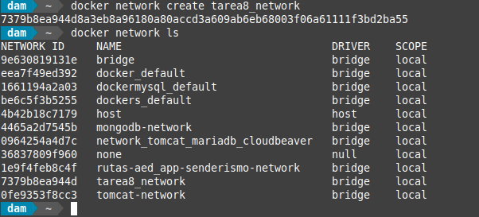
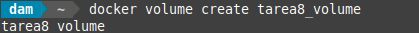
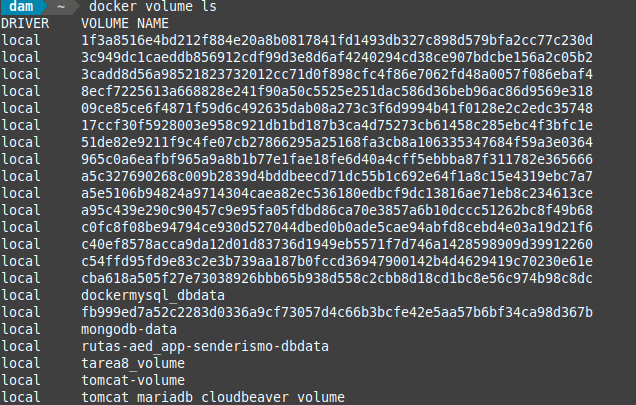
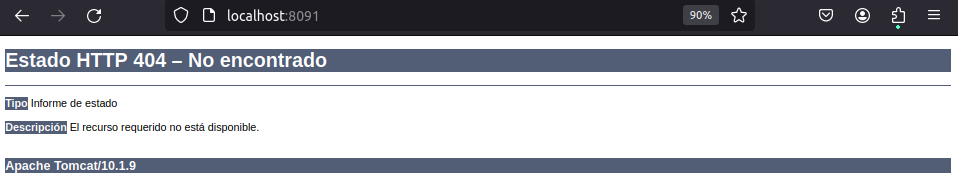
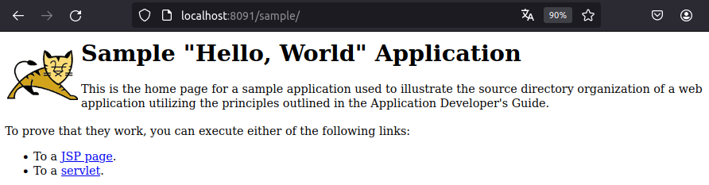
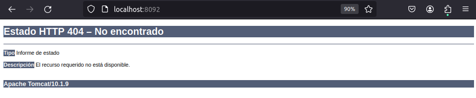
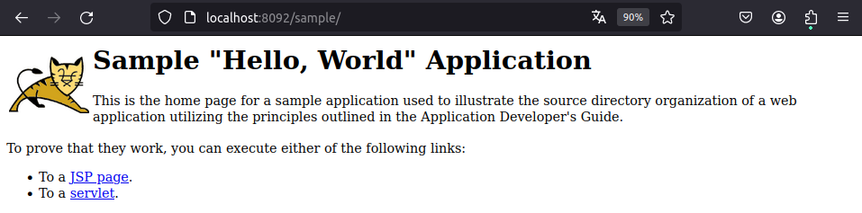
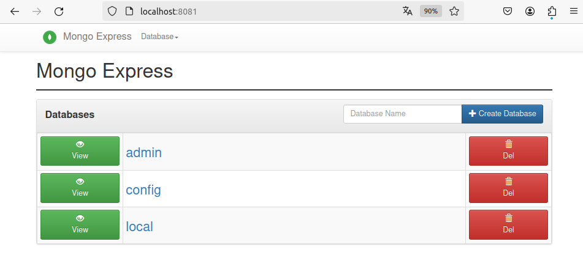
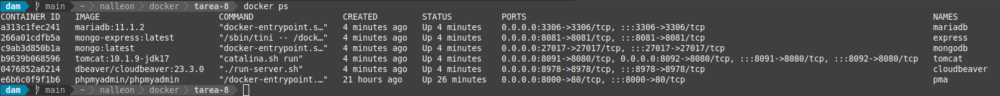

<div align="justify">

## Tarea 8

El objetivo de este ejercicio es crear un entorno con Docker que incluya dos servidores Tomcat, una base de datos MariaDB y una bbdd no sql y así como los clientes para acceder a ambas bases de datos. Para esto, configuraremos los contenedores con redes personalizadas y un volumen común para persistir datos.

- [Práctica 01](#práctica-01)
    - [Práctica 01.1](#práctica-011)
    - [Práctica 01.2](#práctica-012)
    - [Práctica 01.3](#práctica-013)
    - [Práctica 01.4](#práctica-014)
    - [Práctica 01.5](#práctica-015)
    - [Práctica 01.6](#práctica-016)
    - [Práctica 01.7](#práctica-017)
    - [Práctica 01.8](#práctica-018)

***

### Práctica 01

#### Práctica 01.1

> 📂
> Crea la red personalizada para que los contenedores puedan comunicarse entre sí.
>

- Comando:
```bash
docker network create tarea8_network
```

- Captura:
<div align="center">

</div>

<br>

***

#### Práctica 01.2

> 📂
> Crea un volumen Docker para persistir los datos.
>


```bash
docker volume create tarea8_volume
```

- Captura:
<div align="center">

</div>

```bash
docker volume ls
```

- Captura:
<div align="center">

</div>

</br>

***

#### Práctica 01.3

> 📂
> A continuación, creamos un Dockerfile que instalará Tomcat, MariaDB y CloudBeaver.
>

Para evitar los problemas de utilizar multiples imagenes en un mismo dockerfile y que perdamos la información, hemos decidido crear un Dockerfile para cada Tomcat, MariaDB y CloudBeaver respectivamente.

- Dockerfile:

```bash

```

<br>

***


#### Práctica 01.5

> 📂
> Construcción de las imagenes.
>

- Comando:
```bash
 docker build -t solucion-servicios .
 docker ps -a 
```

- Capturas:
<div align="center">



</div>


<br>

***

#### Práctica 01.6

> 📂
> Ejecución del contenedor
>

- Comando:

```bash
docker run --name tarea8 -d -p 8091:8080 -p 8092:8080 -p 3306:3306 -p 27017:27017 -p 8978:8978 solucion-servicios
```

- Capturas:
<div align="center">


</div>

<br>

***

#### Práctica 01.7

> 📂
> Añadimos manualmente nuestros contenedores a la red
>

- Comando:

```bash
docker network connect network_tomcat_mariadb_cloudbeaver tomcat-container
docker network connect network_tomcat_mariadb_cloudbeaver mariadb-container
docker network connect network_tomcat_mariadb_cloudbeaver cloudbeaver-container
```

<br>

#### Práctica 01.8

> 📂
> Tratamos de acceder a CloudBeaver y testear la conexión con la bbdd así cómo probar que tomcat esta ejecutandose
>

- Direcciones a comprobar:

```bash
localhost:8978
localhost:8091/sample
```


- Capturas:
<div align="center">



</div>

<br>

#### Práctica 01.8

> 📂
> Detener y eliminar los contenedores
>

- Comandos:

```bash
docker stop solucion-servicios
docker rm solucion-servicios
```


- Capturas:
<div align="center">


</div>

<br>


</div>